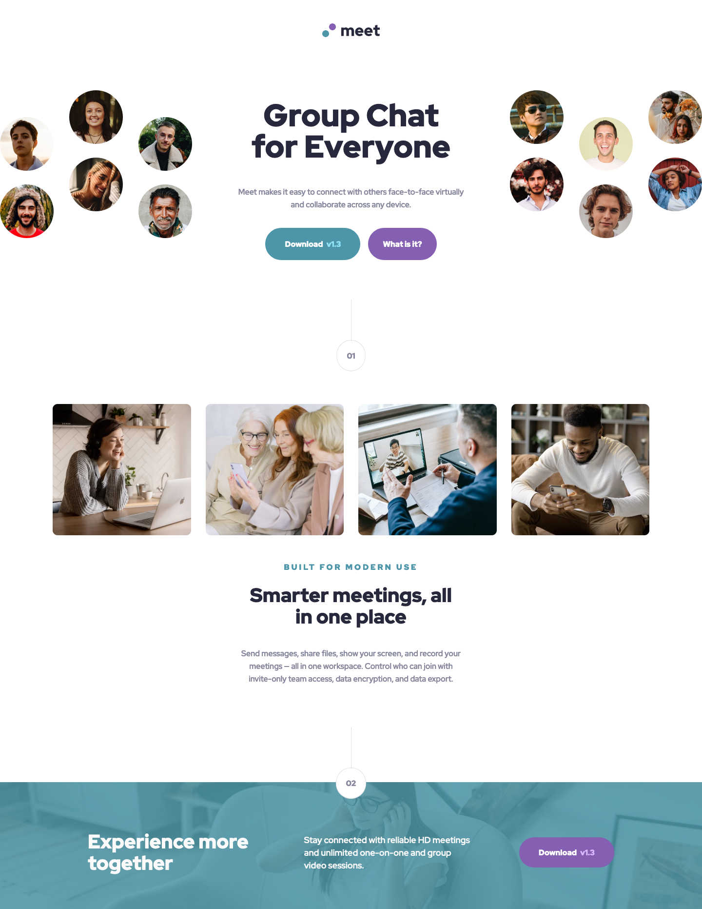

# Frontend Mentor - Meet landing page solution

This is a solution to the [Meet landing page challenge on Frontend Mentor](https://www.frontendmentor.io/challenges/meet-landing-page-rbTDS6OUR). Frontend Mentor challenges help you improve your coding skills by building realistic projects.

## Table of contents

- [Overview](#overview)
  - [The challenge](#the-challenge)
  - [Screenshot](#screenshot)
  - [Links](#links)
- [My process](#my-process)
  - [Built with](#built-with)
  - [What I learned](#what-i-learned)
  - [Continued development](#continued-development)
  - [Useful resources](#useful-resources)
- [Author](#author)

## Overview

### The challenge

Users should be able to:

- View the optimal layout depending on their device's screen size
- See hover states for interactive elements

### Screenshot

### Links

- Solution URL: [Add solution URL here](https://your-solution-url.com)
- Live Site URL: [https://fem-meeting-landing-page.vercel.app/](https://fem-meeting-landing-page.vercel.app/)

## My process

### Built with

- Semantic HTML5 markup
- BEM naming convention
- SASS
- Flexbox
- CSS Grid
- Mobile-first workflow

### What I learned

This is the largest Front End Mentor Challenge I have built so far. I feel like I learned a lot about my workflow as a result:

- I need to start using the BEM naming convention, as I was working, it quickly became clear that my own naming of classes etc at the beginning were quite confusing, so I looked into BEM more and converted my class names. As a result, it became much easier to understand my code.

- I haven't used SASS for a while now, so I was just getting used to the syntax again, but I feel like I can definitely make my code cleaner and easier to read in the future. Next time I use SASS I hope to include the use of some mixins and functions along with breaking my files into partials.

- The way I usually work is building the complete mobile site version first before I convert to the table version and then desktop. I do feel like I have to jump about a lot in my code building this way - although it has helped in being able to read back my own code and figure out how I've build something at a later point, but in my next project I want to build from top to bottom, completing one section fully from mobile to desktop before moving down the page to the next section and so on. I have seen several people recommend building this way, and I want to see if that will make my workflow more efficient.

Other observations:

- I feel like I've got more of a grip with flexbox after this challenge. The footer on the desktop version gave me a bit of a run for my money until I got the hang of using flex-grow to achieve the desired result.

- I surprised myself at how easy I found using Grid in this challenge. Although I only used it on a small part of the site, a few weeks ago I would have had a lot more trouble achieving the result I did so quickly.

- I have been using the dev tools on Google Chrome a lot more effectively to find issues or to help me find things I'm looking for faster. I came across a good tip in one of the courses I have been doing by Jonas Schmedtmann ( link below ) and that was how to use the computed values list. You can just look through the list, or search for the property you are looking for and it will tell you what value it has - because whether you set a style or not, every property has a value set. This seems obvious, but is a good thing to bear in mind for beginners. Using the computed styles list has helped me quickly solve a few things in this project.

### Continued development

Like I mentioned above, I want to use SASS more effectively and to write cleaner code. I want to build up my knowledge of mixins etc in SASS to help with this. I'm currently making my way through a course that includes SASS lectures, so hopefully I'll be able to use it more effectively as I build on my knowledge.

### Useful resources

- [Advanced CSS and Sass - Jonas Schmedtmann](https://www.udemy.com/course/advanced-css-and-sass/) - This course by Jonas Schmedtmann has actually really helped with not only building my knowledge of CSS and SASS, but also how to use the dev tools more effectively and also his courses have helped me to find better answers in Google for things I am stuck on (often overlooked in other courses I have taken, but essential skills for developers). Highly recommend any of his courses on Udemy.

## Author

- Frontend Mentor - [@claire-ca](https://www.frontendmentor.io/profile/claire-ca)
